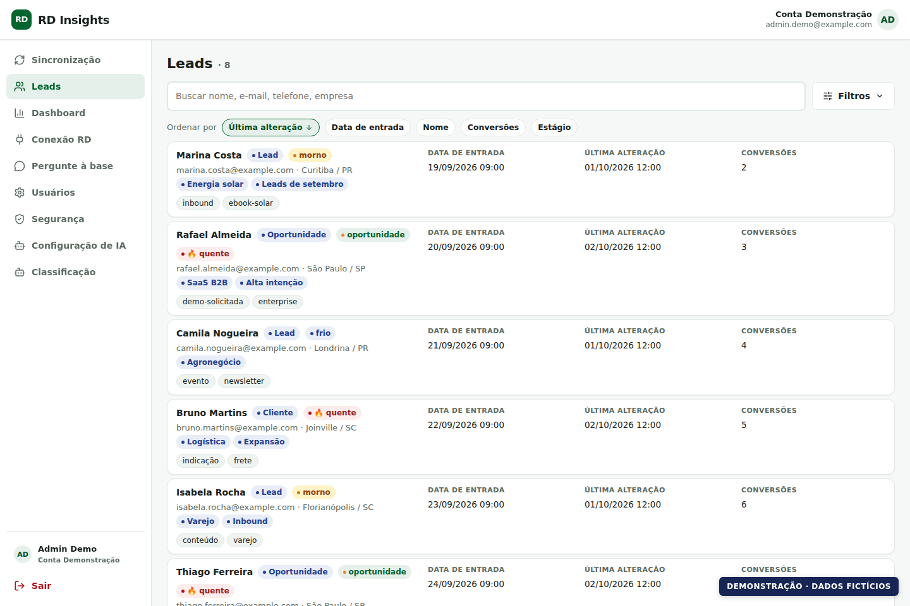

# RD Insights

**Seus leads e segmentações do RD Station Marketing em um painel que você hospeda.**

Explore contatos, acompanhe conversões, compare segmentações e consulte a atualização dos dados em um só lugar. O RD Insights conecta-se à API oficial do RD Station Marketing e mantém uma base local para consultas, filtros e análises.

[Começar com Docker](#instalar-com-docker) · [Desenvolvimento local](#desenvolvimento-local) · [Conectar ao RD](#conectar-ao-rd-station-marketing) · [Documentação](#documentação) · [MIT](LICENSE)



*Demonstração da interface real com dados fictícios. Nomes, empresas, e-mails e métricas desta imagem não representam clientes ou resultados reais.*

## O que você pode fazer

| Recurso | Como ajuda no dia a dia |
| --- | --- |
| Múltiplas segmentações | Monitore os grupos que você usa no RD. Um contato presente em vários grupos permanece um único lead. |
| Lista de leads | Pesquise contatos, combine filtros, salve visões e exporte os resultados em CSV. |
| Ficha do contato | Consulte dados importados, eventos, participação nos segmentos e cobertura dos endpoints. |
| Sincronização por etapas | Acompanhe descoberta, importação, enriquecimento e histórico, com progresso e checkpoints persistidos. |
| Atualização automática | Reconciliação recorrente, refresh rotativo, catálogo de segmentos e processamento de webhooks. |
| Dashboard | Explore métricas da base e do período selecionado. Analytics nativos do RD aparecem identificados como globais da conta. |
| IA opcional | Configure seu provedor para classificação de leads, insights e perguntas à base por consultas estruturadas. |
| Acesso da equipe | Gerencie administradores e usuários de consulta, convites e autenticação em duas etapas. |

O projeto integra **RD Station Marketing**. Não é uma integração com RD Station CRM. A disponibilidade de campos e analytics depende do acesso liberado pela API da sua conta RD. SMTP e IA são opcionais para explorar os leads, mas necessários para os recursos que dependem deles.

## Antes de começar

Escolha uma das instalações abaixo:

- **Docker:** executa aplicação, PostgreSQL e Redis. Indicada para hospedar e usar o painel.
- **Desenvolvimento local:** executa a interface e a API em modo de desenvolvimento; Docker fornece PostgreSQL e Redis.

Você precisará de Git, Docker Engine com Docker Compose e uma conta RD Station Marketing com acesso para autorizar um aplicativo. Para uma instalação acessível pela internet, prepare um domínio e proxy reverso com HTTPS. Os comandos de terminal abaixo usam Bash — Linux, macOS ou WSL.

## Instalar com Docker

### 1. Obtenha o projeto

```bash
git clone https://github.com/aireset/rd-insights-oss.git
cd rd-insights-oss
```

### 2. Configure o ambiente

Crie um arquivo `.env` na raiz do projeto com a configuração abaixo. **Substitua os campos entre `<...>`; eles não são valores prontos para uso.** O `.env.example` existente é voltado ao desenvolvimento local, não à produção.

```dotenv
NODE_ENV=production
PORT=22501
APP_URL=https://app.example.com
CORS_ORIGIN=https://app.example.com

POSTGRES_USER=rd
POSTGRES_PASSWORD=<SENHA_HEXADECIMAL_DO_BANCO>
POSTGRES_DB=rd
DATABASE_URL=postgresql://rd:<MESMA_SENHA_DO_BANCO>@postgres:5432/rd
REDIS_URL=redis://redis:6379

JWT_ACCESS_SECRET=<SEGREDO_JWT>
SECRETS_KEY=<CHAVE_BASE64_DE_32_BYTES>
REGISTRATION_OPEN=false

RD_RECONCILIATION_ENABLED=true
RD_RECONCILIATION_INTERVAL_MINUTES=60
RD_REFRESH_ENABLED=true
RD_RATE_LIMIT_PER_MIN=60
```

Gere valores independentes para senha do banco, segredo JWT e chave de cifra:

```bash
openssl rand -hex 24    # POSTGRES_PASSWORD; repita o mesmo valor em DATABASE_URL
openssl rand -hex 32    # JWT_ACCESS_SECRET
openssl rand -base64 32 # SECRETS_KEY
chmod 600 .env
```

Guarde `SECRETS_KEY` junto dos seus backups seguros: ela é necessária para decifrar credenciais salvas. Não a substitua simplesmente em uma instalação que já contém dados cifrados. Nunca envie o `.env` para o GitHub.

### 3. Inicie os serviços

```bash
docker compose -f docker-compose.prod.yml up -d --build
docker compose -f docker-compose.prod.yml ps
curl --fail http://127.0.0.1:22501/api/health
```

A imagem compila a interface e a API; as migrações do banco são aplicadas na inicialização. O endpoint de saúde informa o estado do banco, Redis e worker.

A aplicação fica vinculada a `127.0.0.1:22501` no servidor. Configure seu proxy reverso para encaminhar **todo o domínio**, incluindo `/api`, a esse endereço. Use o mesmo domínio HTTPS em `APP_URL` e `CORS_ORIGIN`. Não publique PostgreSQL ou Redis na internet.

### 4. Crie o primeiro administrador

Na instalação com banco vazio, abra `/registrar` no domínio configurado e crie a primeira conta. Esse primeiro cadastro é permitido mesmo com `REGISTRATION_OPEN=false`. Faça isso com acesso externo restrito, antes de liberar a instalação aos demais usuários.

Depois, mantenha o cadastro público fechado e convide sua equipe pela tela **Usuários**. Convites e recuperação de senha precisam de SMTP. A configuração opcional `SUPER_ADMIN_EMAIL` concede uma exceção ao cadastro fechado; use-a somente se precisar desse comportamento.

Para acompanhar a aplicação:

```bash
docker compose -f docker-compose.prod.yml logs -f api
```

## Conectar ao RD Station Marketing

1. Crie um aplicativo para **RD Station Marketing** no [App Publisher do RD Station](https://appstore.rdstation.com). Veja também a [documentação oficial de integrações](https://developers.rdstation.com/docs/desenvolvimento-de-integra%C3%A7%C3%B5es).
2. Cadastre a URL de callback da sua instalação, por exemplo: `https://app.example.com/api/rd/callback`.
3. No RD Insights, abra **Conexão RD** (`/conectar`) e salve o `client_id` e o `client_secret` do aplicativo.
4. Clique em **Autorizar no RD** e entre com um usuário que tenha acesso à conta RD desejada.
5. Selecione **uma ou mais segmentações** para monitorar. O botão **Atualizar catálogo** busca a lista disponível no RD.
6. Clique em **Iniciar carga** e acompanhe as etapas por segmento. Os leads importados ficam disponíveis em **Leads**.

**A URL de callback deve corresponder exatamente à cadastrada no RD:** protocolo, domínio, porta e caminho. `APP_URL` é o endereço que você abre no navegador, sem `/` ao final; o sistema acrescenta `/api/rd/callback`.

As credenciais podem ser informadas por conta na interface. `RD_CLIENT_ID` e `RD_CLIENT_SECRET` no ambiente são um fallback para contas sem credenciais próprias. Não são necessários para iniciar o painel e criar seu usuário.

Para OAuth e recebimento de webhooks fora da sua máquina, use uma instalação HTTPS acessível externamente. O endereço local usado no desenvolvimento só funciona no fluxo OAuth se for aceito e cadastrado pelo RD; webhooks não alcançam um servidor disponível apenas em `localhost`.

## Usar o painel

- **Leads:** pesquise, filtre por segmentos e atributos, escolha união ou interseção dos grupos, salve visões e exporte CSV. Abra um contato para consultar sua ficha e os dados disponíveis.
- **Dashboard:** escolha o período e o escopo da análise. Diferencie métricas da sua base das métricas globais fornecidas pelo RD.
- **Sincronização:** consulte agenda, execuções, progresso e falhas. Uma execução parcial pode indicar orçamento esgotado ou dados indisponíveis; consulte o motivo antes de iniciar outra carga.
- **Usuários e Segurança:** convide a equipe, defina permissões e configure 2FA. Guarde os códigos de recuperação fora da aplicação.

### Como as atualizações funcionam

A reconciliação roda a cada **60 minutos** por padrão, configurável por `RD_RECONCILIATION_INTERVAL_MINUTES`. As agendas diárias atuais usam o fuso `America/Sao_Paulo`: catálogo às **01:30**, refresh às **02:00** e analytics às **04:00**.

O refresh trabalha com orçamento de chamadas e checkpoints. Bases grandes podem exigir vários lotes; o agendamento diário não significa que todos os dados serão atualizados em 24 horas. `RD_RATE_LIMIT_PER_MIN` limita as chamadas desta aplicação e não aumenta a cota contratada no RD.

Webhooks complementam as rotinas agendadas. Consulte o estado da integração no painel e o [guia de webhooks](docs/WEBHOOKS.md).

## Recursos opcionais

### E-mail: convites e recuperação de senha

Acrescente as variáveis ao `.env` e configure os dados do seu provedor:

```dotenv
SMTP_HOST=smtp.example.com
SMTP_PORT=587
SMTP_SECURE=false
SMTP_REQUIRE_TLS=true
SMTP_USER=<USUARIO_SMTP>
SMTP_PASS=<SENHA_SMTP>
SMTP_FROM=RD Insights <no-reply@example.com>
```

O exemplo usa STARTTLS na porta 587. Para outro tipo de transporte, ajuste conforme seu provedor. Após editar o ambiente em Docker, reaplique `docker compose -f docker-compose.prod.yml up -d`. Sem SMTP, os e-mails não são enviados; não há um link de recuperação exposto nos logs para contornar essa configuração.

### Inteligência artificial

1. Abra **Configuração de IA** (`/configuracao/ia`).
2. Configure provedor, URL HTTPS compatível, modelo, chave, limite mensal e limite de requisições.
3. Em **Classificação** (`/ia/classificacao`), informe também os preços por milhão de tokens de entrada e saída. Os custos são em USD; preço zero deve ser informado explicitamente.
4. Use classificação, insights e **Pergunte à base** (`/ia/chat`) conforme a configuração habilitada.

A chave e os custos do provedor são de responsabilidade da sua instalação. A lista de leads e a sincronização funcionam sem IA. Provedores apontando para redes privadas ou `localhost` são recusados pela proteção de acesso a URLs. Detalhes no [guia de IA](docs/AI-CLASSIFICATION.md).

## Desenvolvimento local

Requisitos adicionais: **Node.js 22** (a imagem Docker também usa essa versão) e Corepack. O projeto fixa `pnpm@10.22.0`.

```bash
git clone https://github.com/aireset/rd-insights-oss.git
cd rd-insights-oss
corepack enable
cp .env.example .env
corepack pnpm install --frozen-lockfile
```

Edite o `.env` da **raiz**: gere `JWT_ACCESS_SECRET` e `SECRETS_KEY` próprios usando os comandos anteriores. Preserve as URLs e portas locais do exemplo nesta modalidade.

```bash
corepack pnpm --filter @rd/api prisma:generate
corepack pnpm db:up
corepack pnpm db:migrate:dev
corepack pnpm dev
```

| Serviço | Endereço local |
| --- | --- |
| Interface | `http://localhost:22500` |
| API e saúde | `http://localhost:22501/api/health` |
| PostgreSQL | `localhost:22506` |
| Redis | `localhost:22509` |

Abra `http://localhost:22500/registrar` para criar o primeiro usuário. O Vite encaminha `/api` para a API: com os valores locais do exemplo, o callback é `http://localhost:22500/api/rd/callback`, e não a porta `22501`.

O comando `db:up` inicia somente PostgreSQL e Redis. Use esse Compose exclusivamente para desenvolvimento: ele tem credenciais de exemplo e publica as portas dos serviços. Não use `db:migrate:dev` contra um banco de produção.

## Atualizar uma instalação

Faça e verifique o backup do banco e das chaves de configuração antes de atualizar. Leia o [CHANGELOG](CHANGELOG.md) e então, no checkout da instalação:

```bash
git pull --ff-only
docker compose -f docker-compose.prod.yml up -d --build
curl --fail http://127.0.0.1:22501/api/health
```

Migrações são aplicadas na inicialização: trocar a imagem por uma anterior não desfaz alterações no banco. Veja o [guia de implantação e backup](docs/DEPLOY.md) antes de atualizar ou restaurar dados.

## Solução de problemas

| Sintoma | O que conferir |
| --- | --- |
| `redirect_uri` inválido | Compare a URL do aplicativo RD com `APP_URL` + `/api/rd/callback`. Verifique também o domínio que está aberto no navegador. |
| Falha ao conectar ao banco em Docker | Use `postgres:5432` em `DATABASE_URL`, e a mesma senha de `POSTGRES_PASSWORD`. `localhost` dentro do container não aponta para o PostgreSQL. |
| Primeiro cadastro recusado | Verifique se o banco já contém usuários. Com cadastro público fechado, novos membros entram por convite. |
| Carga sem avançar ou parcial | Confira a etapa, a mensagem de erro, o worker/Redis no endpoint de saúde e o orçamento de chamadas. |
| RD pede nova autorização | Reautorize a conexão em **Conexão RD** e confira permissões do aplicativo. |
| Analytics indisponível | Confira o plano e as permissões da conta RD. Nem todos os endpoints estão disponíveis em todas as contas. |
| Convite ou recuperação não chega | Configure SMTP e remetente; consulte o erro apresentado e os logs do serviço, sem divulgar credenciais. |
| IA não configurada ou sem classificação | Confira chave, provedor ativo, modelo, orçamento e os dois preços por milhão de tokens. |

## Documentação

- [Implantação e backup](docs/DEPLOY.md)
- [Múltiplas segmentações](docs/MULTISSEGMENTACOES.md)
- [Reconciliação recorrente](docs/RECONCILIACAO.md)
- [Refresh rotativo e orçamento](docs/REFRESH-ROTATIVO.md)
- [Cobertura e atualização dos dados](docs/COBERTURA-DADOS.md)
- [Webhooks](docs/WEBHOOKS.md)
- [Usuários e convites](docs/USERS.md)
- [Configuração e classificação com IA](docs/AI-CLASSIFICATION.md)

## Contribuir

Encontrou um problema? [Abra uma issue](https://github.com/aireset/rd-insights-oss/issues) com os passos para reproduzir, o comportamento esperado e a versão utilizada. Remova dados de contatos, chaves, tokens e arquivos de ambiente dos exemplos e prints.

Para contribuir com código, faça um fork, crie uma branch e abra um pull request. O monorepo está organizado em `apps/api` (NestJS/Prisma), `apps/web` (React/Vite) e `packages/shared` (tipos e validações). Os comandos disponíveis incluem `corepack pnpm build`, `corepack pnpm lint`, `corepack pnpm typecheck` e `corepack pnpm test`. Testes de integração exigem um banco descartável; nunca aponte testes para a base em uso.

## Licença

Distribuído sob a [licença MIT](LICENSE).
